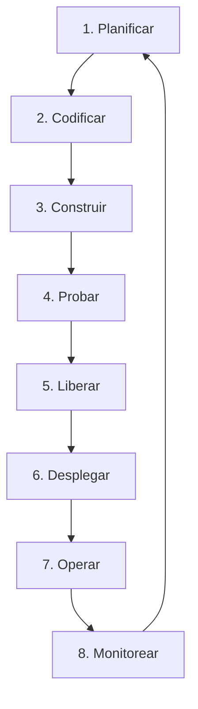

# 💸 Splitz - API de Gestión Financiera y Distribución de Sueldo

**Splitz** es una API REST moderna y eficiente desarrollada en **Go 1.23** diseñada para facilitar la planificación financiera y la distribución inteligente del salario neto mensual. Permite a los usuarios dividir sus ingresos según metodologías financieras comprobadas o mediante distribuciones personalizadas.

El objetivo a mediano plazo de este repositorio es evolucionar de una API REST robusta a una **aplicación web completa** con interfaz gráfica interactiva, persistencia de datos y análisis de salud financiera.

Este proyecto ha sido estructurado y configurado bajo los estándares de la metodología **DevOps**, asegurando una entrega continua, calidad de código mediante pruebas automatizadas y observabilidad en producción.

---

## 🎯 Objetivo del Repositorio

1. **Gestión de Sueldos y Presupuestos:** Centralizar la lógica para recibir ingresos netos y calcular de manera instantánea cómo debe distribuirse ese dinero para cumplir con objetivos de ahorro, pago de deudas, gastos necesarios y estilo de vida.
2. **Plantilla de Aprendizaje DevOps:** Servir como un caso de estudio real para la implementación de pipelines de Integración Continua y Despliegue Continuo (CI/CD), contenedores, monitoreo y buenas prácticas de desarrollo de software.

---

## 🏗️ Estructura del Proyecto

El código sigue una arquitectura limpia adaptada para proyectos de Go:

```text
├── cmd/
│   └── api/
│       └── main.go                 # Punto de entrada de la aplicación. Configura y arranca el servidor HTTP.
├── internal/
│   ├── handlers/
│   │   ├── budget.go               # Handlers HTTP para cálculo de presupuestos (fijos y personalizados).
│   │   ├── health.go               # Handler para verificar el estado de salud de la API (/health).
│   │   └── salary.go               # Handler para registrar el sueldo neto inicial.
│   ├── models/
│   │   ├── budget.go               # Estructuras de datos (JSON) para las peticiones y respuestas de presupuestos.
│   │   └── salary.go               # Estructuras de datos para ingresos y saldos.
│   ├── server/
│   │   └── router.go               # Configuración de rutas y enrutador HTTP utilizando go-chi/v5.
│   └── service/
│       └── budget_service.go       # Lógica de negocio y algoritmos de distribución financiera.
├── test/
│   └── api_test.go                 # Pruebas unitarias y de integración de la API.
├── go.mod                          # Definición del módulo Go y dependencias.
├── go.sum                          # Sumas de verificación de dependencias.
└── README.md                       # Documentación principal del proyecto.
```

---

## 🚀 Rutas de la API (API Endpoints)

### 1. Health Check
Verifica que la API esté activa y funcionando correctamente.
* **URL:** `/health`
* **Método:** `GET`
* **Respuesta Exitosa (200 OK):**
  ```json
  {
    "status": "UP"
  }
  ```

### 2. Ingreso de Salario Neto
Registra el salario neto y valida que sea apto para procesamiento.
* **URL:** `/api/v1/salary`
* **Método:** `POST`
* **Cuerpo de la Petición:**
  ```json
  {
    "net_salary": 2500.0
  }
  ```
* **Respuesta Exitosa (201 Created):**
  ```json
  {
    "net_salary": 2500.0,
    "salary": 2500.0,
    "ready_for_processing": true
  }
  ```

### 3. Calcular Presupuesto Fijo
Aplica uno de los 3 métodos predefinidos de distribución financiera.
* **URL:** `/api/v1/budget/calculate`
* **Método:** `POST`
* **Cuerpo de la Petición:**
  ```json
  {
    "salary": 3000.0,
    "method": 1
  }
  ```
  * *Método 1 (Modo Enfoque):* 50% Necesidades (`needs`), 30% Pago de Deudas (`debt`), 10% Ahorro (`savings`), 10% Deseos (`desires`).
  * *Método 2 (Modo Inversionista):* 40% Necesidades (`needs`), 40% Ahorro/Inversión (`savings` / `investment`), 20% Deseos (`desires`).
  * *Método 3 (Modo Disfrute):* 40% Necesidades (`needs`), 40% Estilo de Vida (`lifestyle`), 20% Ahorro (`savings`).
* **Respuesta Exitosa (200 OK):**
  ```json
  {
    "salary": 3000,
    "method": 1,
    "method_name": "Modo Enfoque",
    "needs": 1500,
    "debt": 900,
    "savings": 300,
    "desires": 300,
    "lifestyle": 0,
    "investment": 0,
    "ready_to_spend": 1800
  }
  ```

### 4. Calcular Presupuesto Personalizado
Permite especificar porcentajes exactos para cada rubro. La suma de los porcentajes debe ser exactamente 100%.
* **URL:** `/api/v1/budget/custom`
* **Método:** `POST`
* **Cuerpo de la Petición:**
  ```json
  {
    "salary": 4000.0,
    "needs": 40.0,
    "debt": 20.0,
    "savings": 20.0,
    "desires": 20.0,
    "lifestyle": 0.0,
    "investment": 0.0
  }
  ```
* **Respuesta Exitosa (200 OK):**
  ```json
  {
    "salary": 4000,
    "needs": 1600,
    "debt": 800,
    "savings": 800,
    "desires": 800,
    "lifestyle": 0,
    "investment": 0,
    "total_percent": 100,
    "ready_to_spend": 2400
  }
  ```

---

## 🛠️ Ejecución Local y Pruebas

### Prerrequisitos
* Tener instalado [Go 1.23](https://go.dev/dl/) o superior.

### Levantar el Servidor
```bash
go run cmd/api/main.go
```
Por defecto, la API escuchará en el puerto `8080` (o el puerto definido por la variable de entorno `PORT`).

### Ejecutar Pruebas
Para ejecutar únicamente los tests que están dentro de la carpeta `test/`:
```bash
go test ./test/... -v
```

Para ejecutar todas las pruebas de tu proyecto (ideal para el pipeline de CI/CD):
```bash
go test ./... -v
```

---

## 🔄 Integración con el Ciclo de Vida DevOps (Las 8 Etapas)

Para cumplir con los requerimientos de la asignatura de **DevOps**, el repositorio está estructurado para soportar las siguientes 8 etapas del ciclo de vida del software e integrarse con herramientas del ecosistema:



### 1. Plan (Planificación)
* **Objetivo:** Definir las historias de usuario (ej. US-03 para el Healthcheck, US-01 para la distribución de salario) y el backlog.
* **Integración:** Control de tareas mediante **GitHub Issues** y **Kanban Boards**. Uso de metodologías ágiles (Scrum/Kanban) para la planeación del paso de API monolítica a arquitectura web completa.
* **Políticas:** Blindaje y protección de la rama `main` requiriendo Pull Requests aprobadas y pruebas en verde antes de hacer merge.

### 2. Code (Codificación)
* **Objetivo:** Escribir código limpio, modular y mantenible.
* **Integración:**
  * Uso de **Git** como sistema de control de versiones.
  * Estrategia de ramificación **GitHub Flow** o **Trunk-Based Development** para asegurar integraciones rápidas.
  * Formateo estricto con `go fmt` y validación estática de código usando linters como `golangci-lint` integrados en el editor o pre-commits.

### 3. Build (Construcción)
* **Objetivo:** Compilar y empaquetar la aplicación de manera repetible y aislada.
* **Integración:** 
  * Dockerización mediante un **Dockerfile Multietapa (Multi-stage Build)**:
    * *Etapa de Compilación:* Usa una imagen de Go oficial (`golang:1.23-alpine`) para descargar dependencias y compilar el binario optimizado.
    * *Etapa de Producción:* Copia únicamente el binario compilado a una imagen ultra ligera (`alpine` o `scratch`), reduciendo la superficie de ataque y el peso de la imagen final a menos de 20MB.

### 4. Test (Pruebas)
* **Objetivo:** Asegurar que los cambios no rompan la funcionalidad existente y validar reglas de negocio.
* **Integración:** 
  * Ejecución automatizada de pruebas unitarias y de integración con el comando `go test ./... -v`.
  * Generación y reporte de cobertura de pruebas (`go test -coverprofile=coverage.out`).
  * Integración en el pipeline de Integración Continua (ej. **GitHub Actions**) donde cada Pull Request ejecuta la suite de pruebas automáticamente antes de permitir la unión a `main`.

### 5. Release (Liberación)
* **Objetivo:** Generar artefactos listos para producción con versiones claras.
* **Integración:**
  * Implementación de **Semantic Versioning (SemVer)** (ej. `v1.0.0`).
  * Pipelines de CD que se disparan ante la creación de un Tag de Git (ej. `v*`).
  * Publicación automática de imágenes Docker en registros como **Docker Hub**, **GitHub Container Registry (GHCR)** o **AWS ECR**.

### 6. Deploy (Despliegue)
* **Objetivo:** Llevar la aplicación a los entornos de Staging/Producción de forma automatizada y sin downtime.
* **Integración:**
  * **Infraestructura como Código (IaC):** Definición de la infraestructura en la nube usando **Terraform** o archivos de manifiesto de Kubernetes.
  * **Estrategias de Despliegue:** Configuración de despliegues progresivos (Blue-Green o Canary) para evitar interrupciones de servicio.
  * **Plataformas de destino:** Despliegue en clusters de Kubernetes (K8s) o servicios administrados de contenedores (Render, AWS ECS, Google Cloud Run).

### 7. Operate (Operación)
* **Objetivo:** Mantener el sistema estable, seguro y escalable en producción.
* **Integración:**
  * Gestión de configuraciones sensibles y secretos utilizando variables de entorno y almacenes de secretos seguros (Vault, GitHub Secrets).
  * Auto-escalado basado en consumo de CPU/Memoria en Kubernetes (Horizontal Pod Autoscaler - HPA).
  * Políticas de tolerancia a fallos y reinicios automáticos de contenedores en caso de fallos críticos.

### 8. Monitor (Monitoreo)
* **Objetivo:** Entender la salud interna de la aplicación y detectar anomalías en tiempo real.
* **Integración:**
  * **Métricas y Alertas:** Exposición de métricas de rendimiento y salud mediante el endpoint `/health`.
  * **Monitoreo Centralizado:** Integración con herramientas de observabilidad como **Prometheus** (para recolección de métricas de consumo y peticiones) y **Grafana** (para visualización en dashboards).
  * **Logs:** Generación de logs estructurados en formato JSON dirigidos a `stdout`/`stderr` para ser capturados por recolectores como Loki, Fluentd o Splunk.