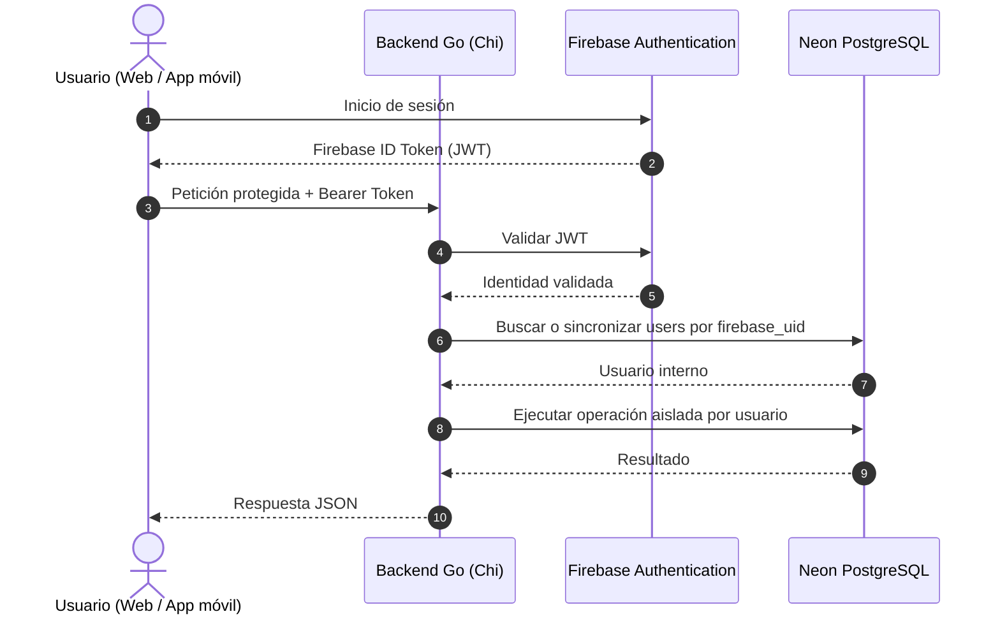

# Documentación de reglas, datos y flujo de Splitz

> Documento de referencia para la futura conexión con Neon PostgreSQL y Firebase Authentication. En esta etapa solo se documenta el contexto; no se ejecutan comandos de infraestructura ni se modifica la lógica de la aplicación.

## 1. Visión general

**Splitz** es una API REST backend desarrollada en Go con el enrutador Chi. Está enfocada en la gestión presupuestaria personalizada, el cálculo adaptativo de finanzas personales, la regla 50/30/20, métodos financieros personalizados y el seguimiento progresivo de deudas, ahorros y gastos fijos mes a mes.

- **Persistencia:** PostgreSQL alojado en Neon.
- **Autenticación:** Firebase Authentication.
- **Backend actual:** Go y Chi.
- **Cliente:** aplicación web React y futura aplicación móvil.
- **Alcance de este documento:** reglas de negocio, modelo de datos, flujo de autenticación, flujo financiero y preparación de integración.

## 2. Reglas de negocio

### RN-01: Identidad y aislamiento por usuario

- Toda petición protegida debe incluir `Authorization: Bearer <firebase-id-token>`.
- El backend valida el JWT con Firebase Admin antes de ejecutar operaciones protegidas.
- El identificador de Firebase se guarda en `users.firebase_uid`.
- Todas las consultas financieras deben filtrar por el usuario autenticado.
- Nunca se debe confiar en un `user_id` recibido directamente del cliente para autorizar acceso.
- Un usuario no puede consultar, modificar ni eliminar datos pertenecientes a otro usuario.
- El usuario de Firebase se crea o sincroniza en `users` después de validar el token.

### RN-02: Gastos fijos y evaluación del 50%

Un registro `FIXED_EXPENSES` representa un compromiso recurrente, como arriendo, servicios públicos, administración o internet.

Al registrar el sueldo del período en `FINANCIAL_SUMMARIES`, la API calcula:

$$
\text{Porcentaje Gastos Fijos} =
\left(\frac{\sum \text{Gastos Fijos Activos}}{\text{Sueldo Base Total}}\right) \times 100
$$

- Si el porcentaje supera `50.00%`, se activa `exceeds_fifty_percent` en el contrato de respuesta del resumen.
- El excedente disponible se calcula como:

$$
\text{Disponible} = \text{Sueldo Base} - \text{Gastos Fijos}
$$

- El disponible sirve como base para distribuir las categorías restantes según el método elegido.
- El valor persistido en `financial_summaries` debe conservar el porcentaje calculado.

### RN-03: Formularios condicionales de ahorros y deudas

- `SAVINGS_ACCOUNTS` y `DEBT_ACCOUNTS` son opcionales para cada período.
- `financial_summaries.has_savings_goal` indica si el período contempla metas de ahorro.
- `financial_summaries.has_debts` indica si el período contempla pagos de deuda.
- Si una bandera es `false`, la distribución se recalcula entre las categorías restantes.
- La ausencia de ahorros o deudas no debe crear registros ficticios ni porcentajes negativos.

### RN-04: Métodos financieros y categorías personalizadas

- Los métodos globales del sistema usan `is_custom = false`.
- Los métodos creados por un usuario usan `is_custom = true` y deben quedar vinculados a `created_by_user_id`.
- Un método personalizado define sus porcentajes en `method_allocations`.
- La suma de las asignaciones aplicables debe validarse antes de calcular un presupuesto.
- El usuario puede crear categorías como `Moda`, `Diversión` o `Mascotas`.
- Las categorías deben tener un tipo controlado: ingreso, gasto, ahorro o deuda.

### RN-05: Reducción progresiva de deudas y acumulado de ahorros

- Las cuentas de deuda y ahorro persisten entre períodos.
- `period_debts` registra las deudas seleccionadas para el período y su pago planeado.
- Los pagos ejecutados reducen `debt_accounts.current_balance`.
- Cuando `current_balance <= 0`, se establece `is_paid_off = true` y el saldo debe quedar normalizado a cero.
- Los depósitos ejecutados incrementan `savings_accounts.current_balance`.
- Las actualizaciones de saldos deben ejecutarse dentro de una transacción de base de datos.

### RN-06: Cierre de período

- Al finalizar el mes, el usuario debe enviar el formulario de cierre.
- Cada gasto fijo se compara contra su valor esperado.
- Si `paid_exact_amount = true`, el backend toma `actual_paid_amount = expected_amount`.
- Si `paid_exact_amount = false`, `actual_paid_amount` es obligatorio y debe ser válido.
- `period_fixed_expenses` conserva el histórico de variaciones.
- `period_closures` consolida los totales y porcentajes finales.
- Un período con `periods.is_closed = true` pasa a modo de solo lectura.
- El cierre debe ser idempotente y no debe permitir consolidar dos veces el mismo período.

## 3. Modelo de datos PostgreSQL / Neon

La siguiente definición es la base propuesta para una migración inicial. Debe ejecutarse mediante migraciones versionadas, no pegándose manualmente en producción.

```sql
CREATE EXTENSION IF NOT EXISTS "uuid-ossp";

CREATE TABLE users (
    id UUID PRIMARY KEY DEFAULT uuid_generate_v4(),
    firebase_uid VARCHAR(128) UNIQUE NOT NULL,
    email VARCHAR(255) UNIQUE NOT NULL,
    name VARCHAR(100),
    created_at TIMESTAMP WITH TIME ZONE DEFAULT CURRENT_TIMESTAMP
);

CREATE TABLE periods (
    id UUID PRIMARY KEY DEFAULT uuid_generate_v4(),
    user_id UUID NOT NULL REFERENCES users(id) ON DELETE CASCADE,
    year INT NOT NULL,
    month INT NOT NULL CHECK (month BETWEEN 1 AND 12),
    is_closed BOOLEAN DEFAULT FALSE,
    created_at TIMESTAMP WITH TIME ZONE DEFAULT CURRENT_TIMESTAMP,
    CONSTRAINT unique_user_period UNIQUE(user_id, year, month)
);

CREATE TABLE methods (
    id UUID PRIMARY KEY DEFAULT uuid_generate_v4(),
    name VARCHAR(100) NOT NULL,
    is_custom BOOLEAN DEFAULT FALSE,
    created_by_user_id UUID REFERENCES users(id) ON DELETE CASCADE
);

CREATE TABLE categories (
    id UUID PRIMARY KEY DEFAULT uuid_generate_v4(),
    name VARCHAR(100) NOT NULL,
    type VARCHAR(20) CHECK (type IN ('INCOME', 'EXPENSE', 'SAVING', 'DEBT'))
);

CREATE TABLE method_allocations (
    id UUID PRIMARY KEY DEFAULT uuid_generate_v4(),
    method_id UUID NOT NULL REFERENCES methods(id) ON DELETE CASCADE,
    category_id UUID NOT NULL REFERENCES categories(id) ON DELETE CASCADE,
    percentage DECIMAL(5,2) NOT NULL CHECK (percentage >= 0 AND percentage <= 100)
);

CREATE TABLE fixed_expenses (
    id UUID PRIMARY KEY DEFAULT uuid_generate_v4(),
    user_id UUID NOT NULL REFERENCES users(id) ON DELETE CASCADE,
    category_id UUID REFERENCES categories(id) ON DELETE SET NULL,
    name VARCHAR(100) NOT NULL,
    expected_amount DECIMAL(12,2) NOT NULL DEFAULT 0.00,
    is_active BOOLEAN DEFAULT TRUE,
    created_at TIMESTAMP WITH TIME ZONE DEFAULT CURRENT_TIMESTAMP
);

CREATE TABLE savings_accounts (
    id UUID PRIMARY KEY DEFAULT uuid_generate_v4(),
    user_id UUID NOT NULL REFERENCES users(id) ON DELETE CASCADE,
    name VARCHAR(100) NOT NULL,
    current_balance DECIMAL(12,2) DEFAULT 0.00,
    created_at TIMESTAMP WITH TIME ZONE DEFAULT CURRENT_TIMESTAMP
);

CREATE TABLE debt_accounts (
    id UUID PRIMARY KEY DEFAULT uuid_generate_v4(),
    user_id UUID NOT NULL REFERENCES users(id) ON DELETE CASCADE,
    name VARCHAR(100) NOT NULL,
    initial_amount DECIMAL(12,2) NOT NULL,
    current_balance DECIMAL(12,2) NOT NULL,
    is_paid_off BOOLEAN DEFAULT FALSE,
    created_at TIMESTAMP WITH TIME ZONE DEFAULT CURRENT_TIMESTAMP
);

CREATE TABLE financial_summaries (
    id UUID PRIMARY KEY DEFAULT uuid_generate_v4(),
    period_id UUID UNIQUE NOT NULL REFERENCES periods(id) ON DELETE CASCADE,
    total_income DECIMAL(12,2) NOT NULL DEFAULT 0.00,
    total_fixed_expenses DECIMAL(12,2) NOT NULL DEFAULT 0.00,
    fixed_expenses_pct DECIMAL(5,2) DEFAULT 0.00,
    has_savings_goal BOOLEAN DEFAULT FALSE,
    has_debts BOOLEAN DEFAULT FALSE,
    method_id UUID REFERENCES methods(id) ON DELETE SET NULL,
    updated_at TIMESTAMP WITH TIME ZONE DEFAULT CURRENT_TIMESTAMP
);

CREATE TABLE period_fixed_expenses (
    id UUID PRIMARY KEY DEFAULT uuid_generate_v4(),
    period_id UUID NOT NULL REFERENCES periods(id) ON DELETE CASCADE,
    fixed_expense_id UUID NOT NULL REFERENCES fixed_expenses(id) ON DELETE CASCADE,
    expected_amount DECIMAL(12,2) NOT NULL,
    paid_exact_amount BOOLEAN DEFAULT TRUE,
    actual_paid_amount DECIMAL(12,2) NOT NULL,
    difference DECIMAL(12,2) GENERATED ALWAYS AS (actual_paid_amount - expected_amount) STORED,
    is_paid BOOLEAN DEFAULT FALSE,
    updated_at TIMESTAMP WITH TIME ZONE DEFAULT CURRENT_TIMESTAMP,
    CONSTRAINT unique_period_fixed_expense UNIQUE(period_id, fixed_expense_id)
);

CREATE TABLE period_savings (
    id UUID PRIMARY KEY DEFAULT uuid_generate_v4(),
    period_id UUID NOT NULL REFERENCES periods(id) ON DELETE CASCADE,
    savings_account_id UUID NOT NULL REFERENCES savings_accounts(id) ON DELETE CASCADE,
    planned_deposit DECIMAL(12,2) NOT NULL DEFAULT 0.00
);

CREATE TABLE period_debts (
    id UUID PRIMARY KEY DEFAULT uuid_generate_v4(),
    period_id UUID NOT NULL REFERENCES periods(id) ON DELETE CASCADE,
    debt_account_id UUID NOT NULL REFERENCES debt_accounts(id) ON DELETE CASCADE,
    planned_payment DECIMAL(12,2) NOT NULL DEFAULT 0.00
);

CREATE TABLE transactions (
    id UUID PRIMARY KEY DEFAULT uuid_generate_v4(),
    period_id UUID NOT NULL REFERENCES periods(id) ON DELETE CASCADE,
    category_id UUID NOT NULL REFERENCES categories(id),
    amount DECIMAL(12,2) NOT NULL,
    type VARCHAR(20) CHECK (type IN ('INCOME', 'EXPENSE', 'SAVING', 'DEBT_PAYMENT')),
    description VARCHAR(255),
    date TIMESTAMP WITH TIME ZONE DEFAULT CURRENT_TIMESTAMP
);

CREATE TABLE period_closures (
    id UUID PRIMARY KEY DEFAULT uuid_generate_v4(),
    period_id UUID UNIQUE NOT NULL REFERENCES periods(id) ON DELETE CASCADE,
    total_income_executed DECIMAL(12,2) NOT NULL,
    total_fixed_expected DECIMAL(12,2) NOT NULL,
    total_fixed_actual DECIMAL(12,2) NOT NULL,
    fixed_expenses_variance DECIMAL(12,2) NOT NULL,
    actual_fixed_expenses_pct DECIMAL(5,2) NOT NULL,
    total_expense_executed DECIMAL(12,2) NOT NULL,
    total_saved_executed DECIMAL(12,2) NOT NULL,
    total_debt_paid_executed DECIMAL(12,2) NOT NULL,
    recommended_saving_pct DECIMAL(5,2) NOT NULL,
    actual_saving_pct DECIMAL(5,2) NOT NULL,
    recommended_debt_pct DECIMAL(5,2) NOT NULL,
    actual_debt_pct DECIMAL(5,2) NOT NULL,
    closed_at TIMESTAMP WITH TIME ZONE DEFAULT CURRENT_TIMESTAMP
);
```

### Decisiones pendientes del esquema

- Añadir índices por `user_id`, `period_id`, `firebase_uid` y fechas de transacción.
- Definir si `categories` es global, por usuario o una combinación de categorías del sistema y personalizadas.
- Añadir restricciones que impidan relacionar un registro de un usuario con una cuenta de otro usuario.
- Definir precisión y redondeo monetario para cada cálculo.
- Validar si `exceeds_fifty_percent` se persiste o se calcula únicamente en la respuesta.
- Versionar el DDL mediante migraciones antes de conectar producción.

## 4. Autenticación con Firebase

### Proyecto

- Firebase project ID: `splitz-b354c`.
- Project number: `project-116186283571`.
- Dominios autorizados: `localhost`, `splitz-b354c.firebaseapp.com` y `splitz-b354c.web.app`.
- Cuenta de servicio esperada: `firebase-adminsdk-fbsvc@splitz-b354c.iam.gserviceaccount.com`.

### Flujo de autenticación

1. El usuario inicia sesión mediante Firebase Authentication en el cliente.
2. Firebase devuelve un Firebase ID Token JWT.
3. El cliente envía el token como `Authorization: Bearer <token>`.
4. Un middleware de Go valida el token usando Firebase Admin SDK.
5. El middleware coloca en el contexto únicamente la identidad validada, incluyendo `firebase_uid`.
6. Los handlers usan esa identidad para crear o consultar el registro en `users`.
7. Los servicios filtran todas las operaciones por el usuario autenticado.

### Inicialización prevista del SDK

El backend deberá leer la ruta de la cuenta de servicio desde una variable de entorno o desde un mecanismo seguro de secretos. Nunca se debe guardar el JSON de la cuenta de servicio en Git.

```go
opt := option.WithCredentialsFile(os.Getenv("FIREBASE_CREDENTIALS_FILE"))
app, err := firebase.NewApp(context.Background(), nil, opt)
if err != nil {
    return nil, fmt.Errorf("error initializing Firebase app: %w", err)
}

authClient, err := app.Auth(context.Background())
if err != nil {
    return nil, fmt.Errorf("error initializing Firebase Auth client: %w", err)
}
```

La implementación anterior es una referencia técnica documentada, no se ejecuta en esta etapa.

## 5. Flujo del sistema



### Flujo financiero

1. El usuario configura gastos fijos, cuentas de ahorro y deudas.
2. El usuario abre un período con año, mes y sueldo base.
3. La API obtiene gastos fijos activos del usuario.
4. La API calcula el porcentaje de gastos fijos y determina si supera el 50%.
5. La API guarda el resumen y las partidas del período.
6. Durante el mes se registran transacciones.
7. Los pagos de deuda y depósitos de ahorro actualizan sus saldos globales dentro de transacciones SQL.
8. El usuario consulta el formulario de cierre.
9. El usuario informa pagos exactos o importes reales.
10. La API guarda variaciones, consolida el cierre y marca el período como solo lectura.

## 6. Contratos funcionales previstos

### Identidad

- `GET /health`: endpoint público de salud técnica.
- Todos los endpoints financieros: requieren Firebase ID Token.
- Respuesta de token inválido: `401 Unauthorized`.
- Usuario autenticado sin autorización sobre el recurso: `403 Forbidden` o respuesta equivalente definida por la API.

### Períodos

- `POST /periods`: crea o recupera el período del usuario autenticado.
- `GET /periods/{id}`: obtiene un período únicamente si pertenece al usuario autenticado.
- Un período cerrado permite lectura, pero no cambios financieros.

### Resumen financiero

- `POST /periods/{id}/financial-summary`: registra sueldo, banderas y método.
- La API calcula gastos fijos activos y porcentaje consumido.
- La respuesta incluye la alerta de superar el 50% cuando corresponda.

### Movimientos

- `POST /periods/{id}/transactions`: registra un movimiento del período.
- `GET /periods/{id}/transactions`: lista movimientos filtrados por período y usuario.
- No se aceptan movimientos nuevos para períodos cerrados.

### Cierre

- `GET /periods/{id}/fixed-expenses-form`: devuelve gastos fijos esperados.
- `POST /periods/{id}/close`: procesa importes reales, saldos y consolidación.
- El cierre debe validar que el período pertenece al usuario y que aún no está cerrado.

## 7. Configuración y secretos

No guardar credenciales en este archivo, en el repositorio, en `README.md`, en el frontend ni en logs.

Variables previstas para desarrollo local o staging:

```text
DATABASE_URL=<NEON_STAGING_DATABASE_URL>
FIREBASE_PROJECT_ID=splitz-b354c
FIREBASE_CREDENTIALS_FILE=<ruta-local-fuera-del-repositorio>
```

Variables previstas para producción:

```text
DATABASE_URL=<NEON_PRODUCTION_DATABASE_URL>
FIREBASE_PROJECT_ID=splitz-b354c
FIREBASE_CREDENTIALS_FILE=<ruta-de-secreto-del-entorno>
```

Las URLs de base de datos compartidas durante la sesión deben considerarse expuestas y rotarse antes de usarlas en un entorno real. El frontend nunca debe recibir `DATABASE_URL` ni credenciales de Firebase Admin.

## 8. Preparación de Neon

Los siguientes comandos son una guía pendiente. No fueron ejecutados al crear este documento:

```bash
npm i -g neon@latest
neon login
neon skills -y
neon mcp -y
neon link --project-id rough-bonus-58887158 --branch production -y
neon config init
neon deploy
```

El archivo `neon.ts` previsto para una configuración posterior será:

```ts
import { defineConfig } from '@neon/config/v1'

export default defineConfig({})
```

Antes de ejecutar cualquier comando se debe confirmar:

- Que el proyecto Neon corresponde al repositorio correcto.
- Que la rama y el entorno (`staging` o `production`) son los esperados.
- Que las credenciales han sido rotadas y se entregarán mediante un gestor de secretos.
- Que existe una migración revisada para el DDL.
- Que no se ejecutarán cambios destructivos sobre producción.

## 9. Orden de implementación posterior

1. Rotar las credenciales expuestas y configurar secretos fuera del repositorio.
2. Crear migraciones PostgreSQL versionadas.
3. Crear conexión Neon mediante `DATABASE_URL` y pool con límites definidos.
4. Añadir middleware de Firebase Authentication.
5. Añadir sincronización de `users` por `firebase_uid`.
6. Añadir repositorios con aislamiento obligatorio por usuario.
7. Implementar períodos y resumen financiero.
8. Implementar gastos fijos, ahorros, deudas y transacciones.
9. Implementar cierre idempotente y modo de solo lectura.
10. Añadir pruebas de autorización, aislamiento y reglas RN-01 a RN-06.
11. Ejecutar migraciones y validaciones primero en staging.
12. Promover a producción únicamente después de validar staging.

## 10. Alcance actual

En esta fase:

- Se crea este documento de contexto.
- No se ejecutan comandos de Neon.
- No se ejecutan migraciones.
- No se agregan dependencias Go.
- No se modifica la API.
- No se modifica la lógica del frontend.
- No se crean archivos de credenciales.
- No se conectan staging ni producción.

La siguiente tarea técnica deberá comenzar por la migración versionada de la base de datos y la configuración segura de `DATABASE_URL`, antes de implementar endpoints financieros.
